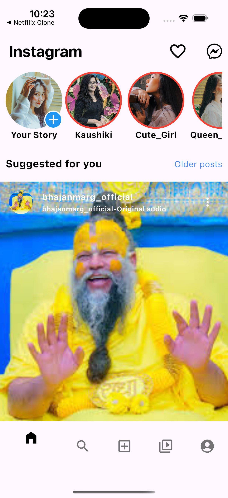
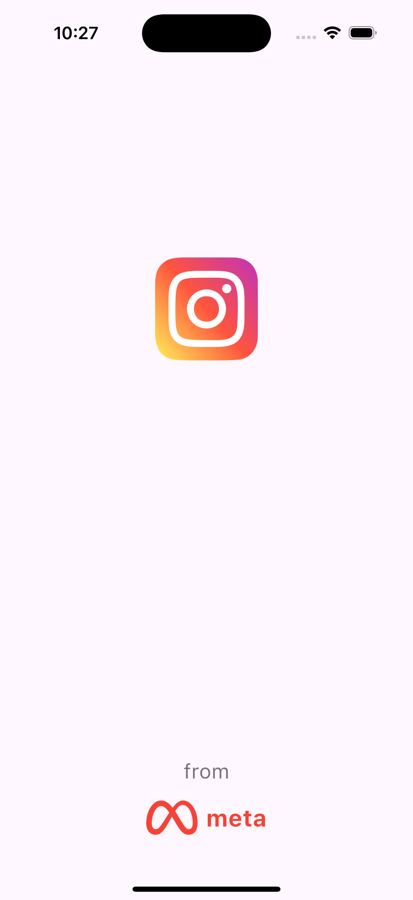
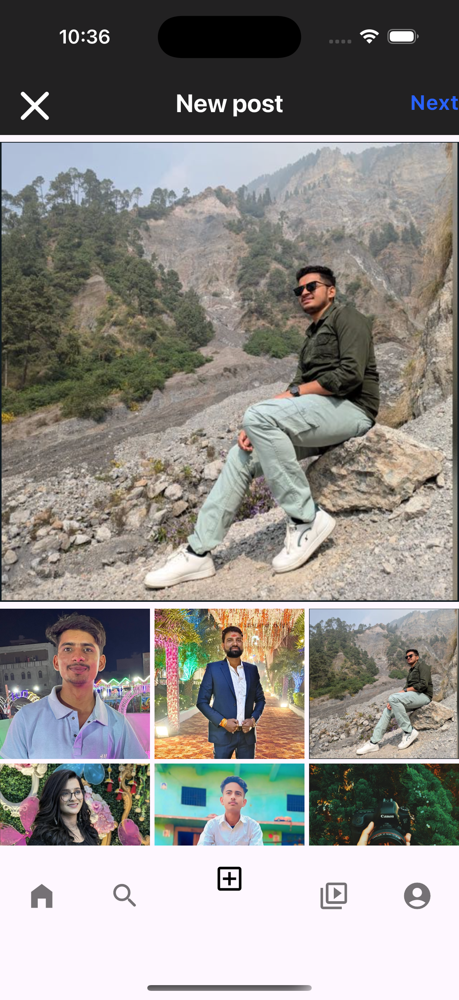
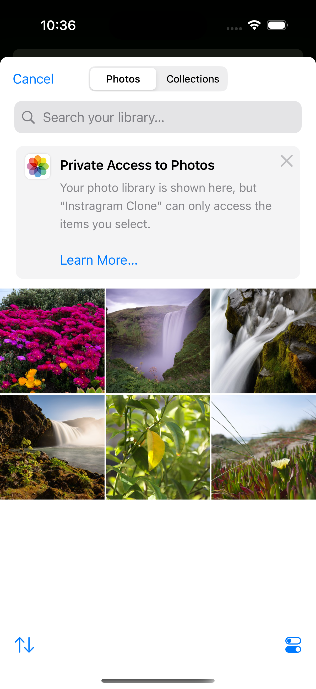
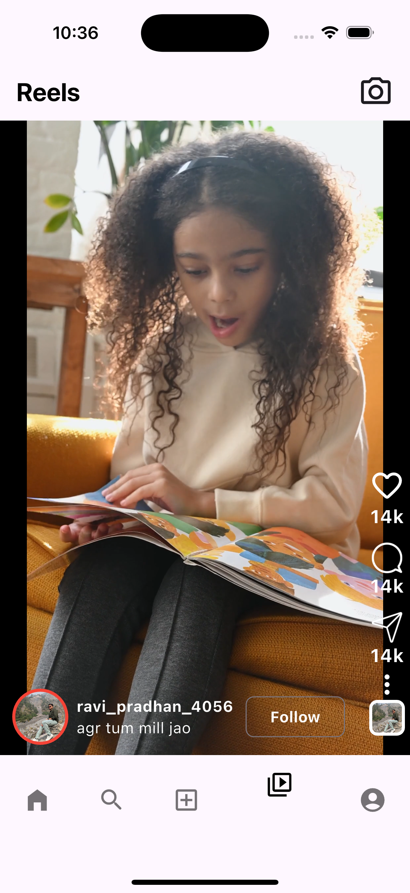
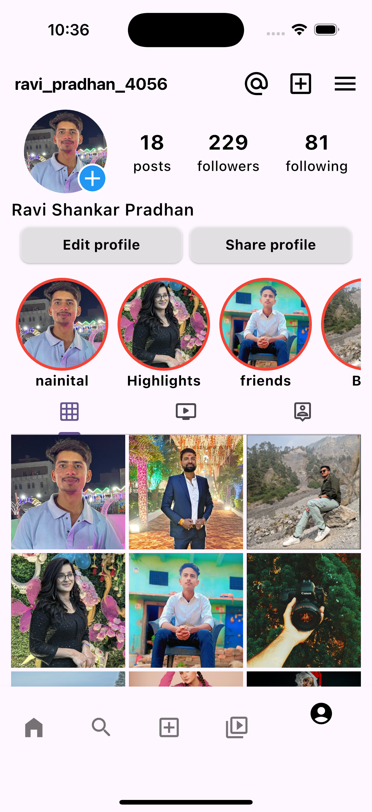
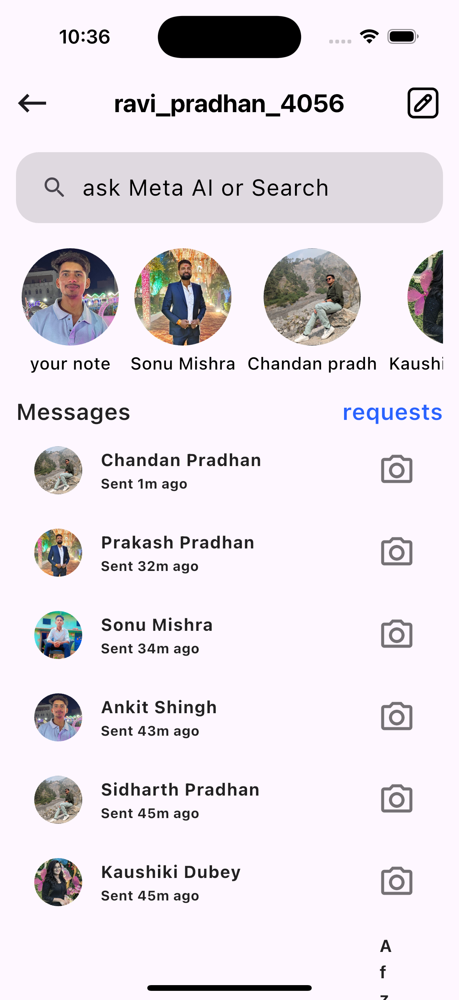

# Instagram UI-Clone App

This is a simple Flutter application.

## Getting Started

1. **Feed and Post Creation**: Implement a visually appealing feed that showcases user posts, including images, videos, and captions. Provide an easy-to-use interface for users to create and share their own posts with options for editing and applying filters.

2. **User Profiles and Stories**: Allow users to create and customize their profiles, complete with profile pictures, bios, and links. Include a Stories feature where users can share temporary content that disappears after 24 hours, enhancing engagement.

3. **Likes and Comments**: Enable interaction through likes and comments on posts, fostering community engagement. Users should be able to view and respond to comments, creating a social environment within the app.

4. **Direct Messaging**: Integrate a direct messaging feature that allows users to communicate privately. This can include text, images, and video sharing, as well as the ability to create group chats for more dynamic interactions.

5. **Explore and Search Functionality**: Provide an Explore page where users can discover new content and accounts based on their interests. Implement a robust search feature that allows users to find other profiles, hashtags, and posts easily.

## App Screenshot

Here are the screenshots of the app:

